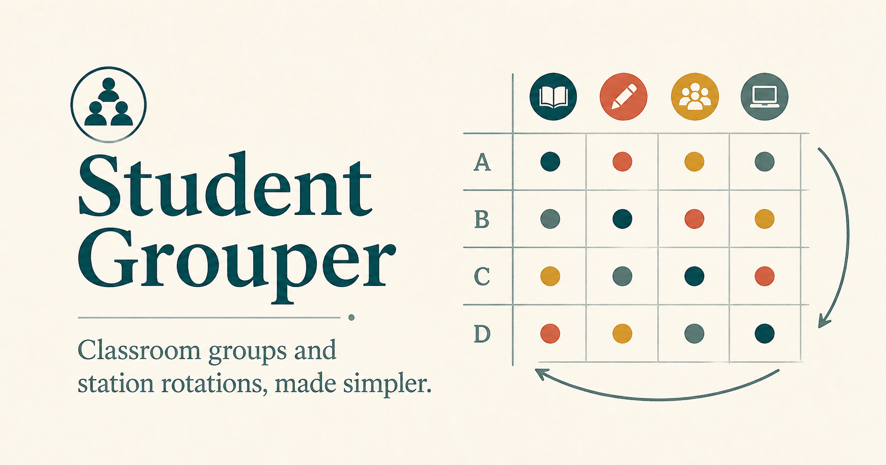

# Student Grouper

Student Grouper is a local-first classroom tool for making student groups, continuing station rotations across days, and printing picture-friendly schedules for young readers.

[Public site](https://student-grouper.jkodesign.chatgpt.site) · [Try it in a browser](https://excodecowboy.github.io/StudentGrouper/) · [Download for Mac](https://github.com/ExCodeCowboy/StudentGrouper/releases/latest)



## Why it exists

This was made for the small, repetitive planning decisions that consume a surprising amount of a teacher’s morning. The app can make a useful first draft, but the teacher stays in control:

- Build mixed or similar reading, math, or writing groups.
- Add one clear secondary preference, such as mixed gender or shared language.
- Note students who work well together or should have space.
- Drag one student without causing other students to jump between groups.
- Lock deliberate choices and rebuild only what remains unlocked.
- Continue activity history across dates, even after regrouping.
- Plan activities and reusable classroom locations separately.
- Print group routes with activity pictures, words, colors, and symbols.
- Export and restore a complete local backup.

## Privacy

Student Grouper has no accounts, cloud database, analytics, advertising, or tracking. The Mac app stores classroom information on that Mac. The browser version stores it inside that browser on that device. Exported backups go only where the teacher chooses to save them.

The app was created with help from AI, but AI is not part of the running app and student information is never sent to an AI model.

## Mac downloads

The release workflow produces two DMG installers:

- `x86_64` for older Intel MacBook Air models.
- `aarch64` for Apple-silicon Macs (M1 and newer).

The current minimum is macOS 10.15. Early public builds are ad-hoc signed rather than Apple-notarized, so macOS may require a Control-click → **Open** confirmation on first launch.

The desktop shell is Tauri. It uses the Mac’s built-in webview instead of shipping a second browser engine, so the application code and local data model are shared with the browser build.

## Development

Install and run the classroom app:

```text
npm install
npm run dev
```

Validation:

```text
npm test
npm run lint
npm run build
```

Run inside the desktop shell:

```text
npm run tauri:dev
```

The public information site lives in `website/` and has its own lockfile and scripts.

## Product boundaries

The project intentionally does not include a student information system integration, behavior tracking, cloud sync, accounts, analytics, AI scheduling, weighted optimization controls, or a multi-week calendar editor. The working product contract is in [PRODUCT_SPEC.md](PRODUCT_SPEC.md).

Created with AI for a teacher I know.
